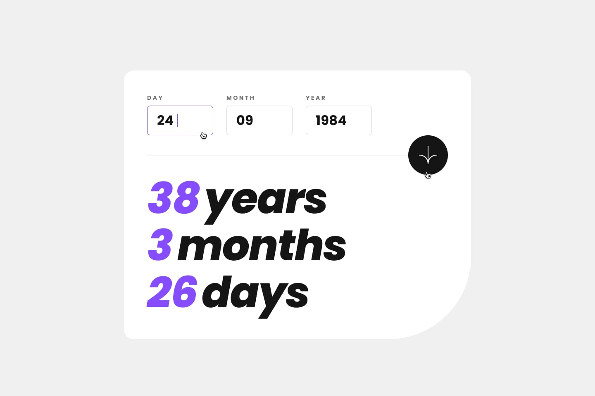

# Frontend Mentor - Age calculator app solution

This is a solution to the [Age calculator app challenge on Frontend Mentor](https://www.frontendmentor.io/challenges/age-calculator-app-dF9DFFpj-Q). Frontend Mentor challenges help you improve your coding skills by building realistic projects.

## Table of contents

- [Overview](#overview)
- [The challenge](#the-challenge)
- [Screenshot](#screenshot)
- [Links](#links)
- [Built with](#built-with)
- [Author](#author)
- [Acknowledgments](#acknowledgments)

## Overview

### The challenge

Users should be able to:

- View an age in years, months, and days after submitting a valid date through the form
- Receive validation errors if:
  - Any field is empty when the form is submitted
  - The day number is not between 1-31
  - The month number is not between 1-12
  - The year is in the future
  - The date is invalid e.g. 31/04/1991 (there are 30 days in April)
- View the optimal layout for the interface depending on their device's screen size
- See hover and focus states for all interactive elements on the page
- **Bonus**: See the age numbers animate to their final number when the form is submitted

### Screenshot

### Mobile

### Desktop-completed.jpg

### Active-states

### Desktop-design

### Desktop-error-empty

### Desktop-error-invalid

### Desktop-error-whole-form

### Links

- [Github](https://github.com/Have-Samuel)
- [Live Link]()

## My process

### Built with

- Semantic HTML5 markup
- CSS custom properties
- Flexbox
- CSS Grid
- Mobile-first workflow
- javascript
- Git & Gitworkflow
- Positioning
- Best practices

## Author

- [Website](https://my-portifolio-git-dev-have-samuel.vercel.app/)
- [linkedIn](https://www.linkedin.com/in/have-samuel/)
- [Frontend Mentor](https://www.frontendmentor.io/profile/Have-Samuel)
- [Twitter](https://twitter.com/samhave)

## Acknowledgments

## 🤝 Contributing

Contributions, issues, and feature requests are welcome!

Feel free to check the [issues page](https://github.com/Have-Samuel/age-Calculator-App/issues).

## Show your support

Give a ⭐️ if you like this project!

## Thanks and Apprecitions

- 🎉 Thanks to Frontend Mentor
- [@Trekab] 🤝 (<https://github.com/trekab>) 👋 Thumbs Up
- etc

## 📝 License

This project is [MIT](./MIT.md) licensed.
